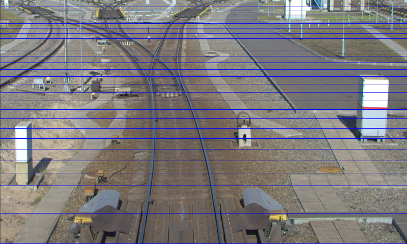
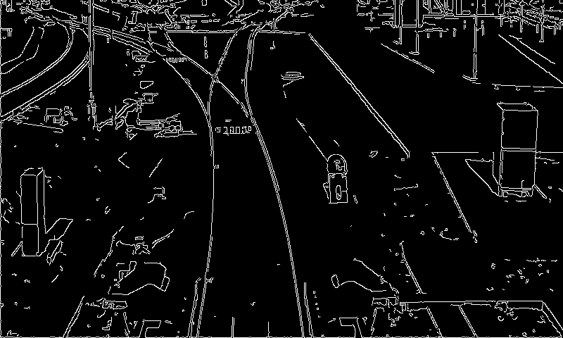
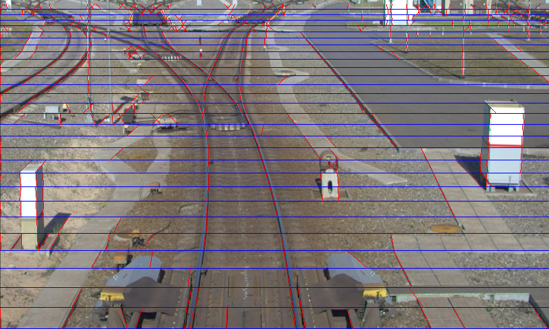
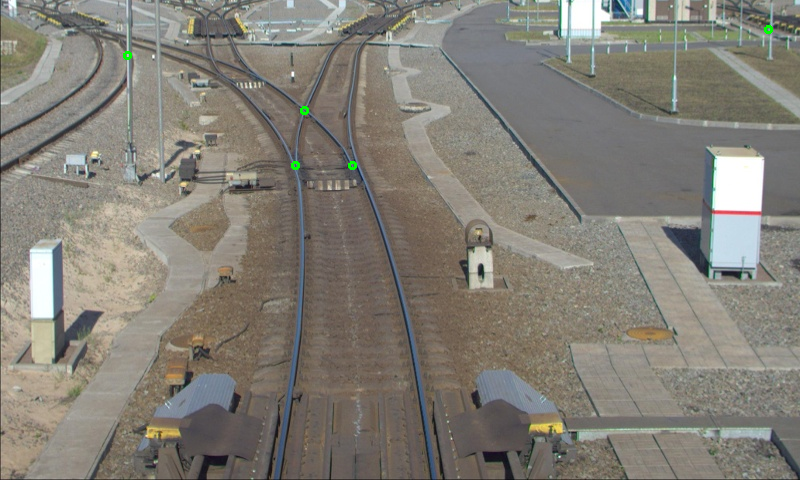
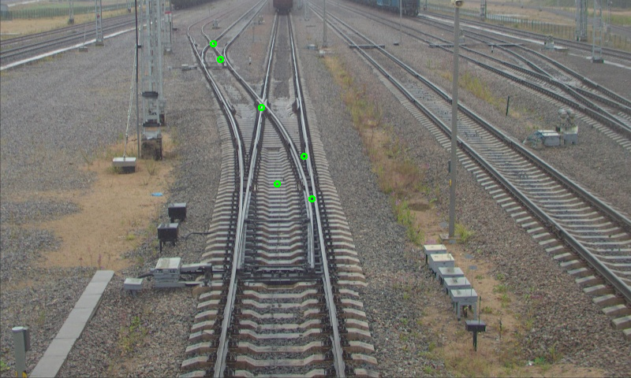

# Постановка задачи  
На вход подается изображение — фотография сделанная с головы поезда. 
Необходимо найти на входном изображении места пересечений железно-дорожных путей. Пересечением будем называть точку, в которой пересекаются рельсы одной ж/д колеи с другой.
На выходе алгоритма должен быть набор точек, в которых было обнаружено пересечение.
 
Замечания: 
Нет задачи максимально точно определить место пересечения, то есть алгоритм находит примерное место пересечения. Предварительно можно сказать, что с точностью некоторой окрестности 50 на 50 пикселей(эти цифры могут поменяться в процессе решения).
Нет задачи искать пересечения, которые находятся на заднем плане снимка. Главное правильно находить все пересечения в пределах 20-30 метров перед поездом. 
Нет ограничений на условия съёмки. Съёмка может проводиться как при дневном свете, так и при искусственном(фонари ночью, такие примеры есть в датасете).

# Установка  
Данный проект можно установить просто командой cmake ..  
Или открыть любую ide, поддерживающую cmake(сейчас все ide его поддерживают) и загрузить туда этот проект, указав CmakeList.txt, как cmake файл проекта.  

#  Program input: path_to_image  
#  Program output:  
image with intersection points and image with detected rails  
#  Dataset:  
Images on which you can test my program stores in foldet: data/  

# Алгоритм  
1. Сначала разбиваем изображение на горизонтальные блоки (блоки отделены на рисунке синими линиями). Размер блоков уменьшается в зависимости от координаты У на изображении, это сделано для учета перспективной проекции объектов из реального мира на изображении - чем дальше объект, тем меньше он на изображении.
  

2. В каждом горизонтальном блоке ищем прямые с помощью алгоритма Хафа(предварительно извлекая края для текущего блока). Параметры алгоритма Хафа следующие:  
HoughLines(imput = canny_image, output = lines, rho = 1, theta = CV_PI/180, threshhold = (y_max - y_min) * 2/3, srn = 0, stn = 0, min_theta = -CV_PI / 3.5, max_theta = CV_PI / 3.5).  
Здесь y_max - значение большей координаты У текущего блока, y_min - значение меньшей координаты У текущего блока. Таким образом, алгоритм Хафа вернет прямые с следующими свойствами:  
- прямые, за которые проголосвало как минимум (y_max - y_min) * 2/3 точек(это нужно для фильтрации прямых вызванных шумом на изображении)  
- прямые которые идут под углом [-pi/3.5, pi/3.5] к вертикальной оси.  
  
  

3. Блоки обрабатываются, начиная с нижнего. И для найденных на каждом из блоков прямых ищуются их "родители" в предыдущем блоке. Родителем называется прямая, у которой верхняя точки совпадает с точностью epsilon=5 пикселей с нижней точкой текущей прямой (то есть прямая в текущей блоке исходит из прямой в предыдщем блоке). Таким образом, после обработки всех горизонтальных блоков появляется некоторый граф из прямых - каждая найденная прямая содержит указатели на соседние прямые(которые исходят из неё вверх), если таковые имеются.

4. Теперь необходимо найти места пересечений рельсов. Для этого, просматриваются все прямые в графе, и для каждой из прямых производится следующая проверка:  
Если прямая имеет несколько соседей и какая-то пара из соседей не является параллельными прямыми, а точнее разность косинусов углов соседних прямых > 0.3, тогда точка, из которой исходят эти соседние прямые является точкой пересечения рельсов.  

# Примеры работы  
  
  

# Какие есть ПРОБЛЕМЫ и как их РЕШАТЬ  
- Почему могут найтись лишнии пересечения? Сейчас может получиться так, что все-таки прямые, получившиеся из-за шумов(столбы и другие прямые линии на изображении) дали условие п.4. Этого можно избежать, если применить алгоритм growing_up с самого низу изображения, для сегментации рельсов. Об этом алгоритме я писал в readme.md этого репозитория: https://github.com/DmitriiTunikov/cross_detect_growing_up  
- Почему находятся не все пересечения ? Видно, что пересечения в далеке для первого примера data/ex1.png не были найдены. Это произошло потому что данные пересечения получаются из прямых, которые мы отсекаем на этапе поиска прямых алгоритмом Хафа theta пренадлежит [-pi/3.5, pi/3.5]. Это отсечения сделано для удаления более горизонтальных прямых, но в данном случае реальные рельсы тоже попали под эту проверку. Что с этим делать? По сути можно убрать вообще ограничения на угол прямых, но для этого необходимо искать границы уже с отсечением горизонтальных границ - таких, у которых градиент направлен вверх/вниз. Это избавит нас от лишних граничных точек, которые плодят голоса в алгоритме Хафа.  

# Мои пожелания по review  
Прошу не писать мне замечания в духе "неиспользованная переменная" или "лучше этот кусок вынести в отдельную функцию". Это не относится к сути предмета вообще.  
В прошлый раз, к сожалению, мне никто не написал вообще замечаний по алгоритму.  
Напишите, пожалуйста, что вы думаете по поводу данного алгоритма, и какие улучшения вы могли бы предложить.
